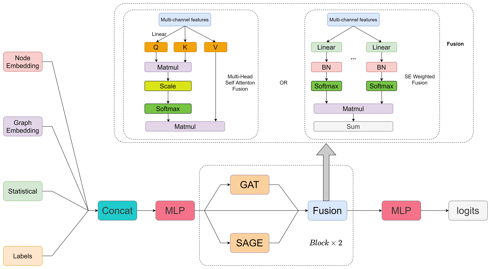
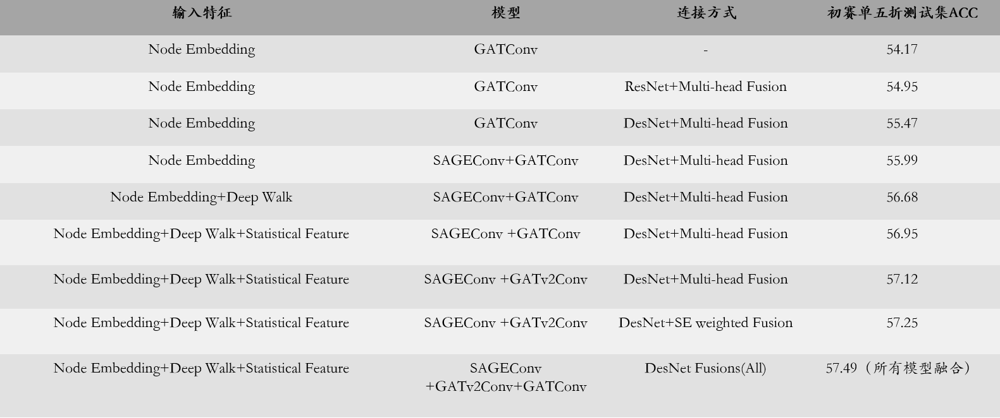
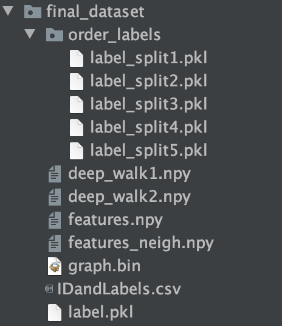
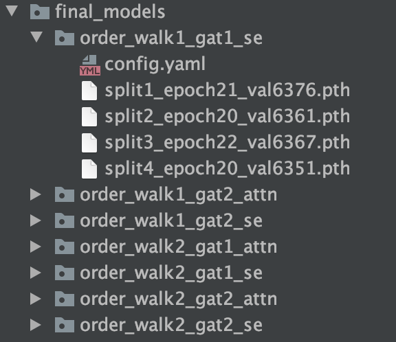

# 2021 MAXP 任务一：基于DGL的图机器学习任务 Rank2

>本说明主要介绍复现的整体流程，可以通过下载预处理好的数据以及模型进行复现。

## 一、项目介绍

### 1.1 赛题介绍

* 赛题地址：[**2021 MAXP 命题赛 任务一：基于DGL的图机器学习任务**](https://www.biendata.xyz/competition/maxp_dgl/)
* 赛题任务：给出图的顶点、顶点特征、连接边，完成未知节点的**单类别**预测，本质为图节点多分单类问题


### 1.2 模型结构



结构简介

* 提取deep walk特征作为网络嵌入特征，出入度以及其一阶二阶领域信息作为统计学特征
* Labels通过标签嵌入与其他特征通过MLP层融合在一起
* 模型用到的图网络结构主要包含SAGEConv 、GATConv 、GATv2Conv这三种基础网络
* 每层的Blocks 输出通过Fusion融合，Fusion包含多头注意力机制以及se融合这两种不同的结构
* Blocks每层通过desnet结构连接

## 二、实验结果



## 三、下载代码

* gitlab仅下载代码部分

```sh
 git clone -b submit https://gitee.com/fu-lang/dgl.git
```

* 完整项目见[百度云盘](https://pan.baidu.com/s/1wCybVuV8CdRsuV3-43MTpw)，提取码：`2inq`

## 四、安装依赖

进入项目根路径

```sh
conda env create -f dgl_env.yaml
conda activate dgl
```

## 五、模型复现

* 下载[预处理好的数据](http://www.vtrust.top:4322/dgl/submit/final_dataset)，并放置于`final_dataset`文件夹中

  需要保证`final_dataset`中拥有以下文件，目录结构如下所示：



* 下载[训练好的模型](](http://www.vtrust.top:4322/dgl/submit/final_models))，并放置于`final_models`文件夹中

  需要保证`final_models`中拥有以下文件，目录结构如下所示：



* 运行测试代码

```sh
conda activate dgl
cd unimp

# 融合七个五折模型进行预测
CUDA_VISIBLE_DEVICES=0 python test.py
# 输入结果文件见unimp/prediction.csv
```

## 六、数据预处理

* 主要工作
  * 处理网络节点，生成对应的网络图
  * 划分k折训练集和验证集
  * 提取deep walk特征、出入度特征

* 从头开始预处理，需将比赛数据集下载至`final_dataset`文件夹中，进入项目根路径，并激活dgl环境

```sh
conda activate dgl

# 数据预处理
cd preprocess
# preprocess1主要用于合并边连接关系文件，合并初赛的验证集与测试集节点
python preprocess1.py
# preprocess2主要用于处理边和节点文件，创建对应节点映射文件与特征文件
python preprocess2.py
# preprocess3主要用于根据边关系创建并保存图
python preprocess3.py
# preprocess4主要用于分层抽样5折划分数据集
python preprocess4.py
# preprocess5主要用于提取并保存出入度以及一阶二阶特征,总维度2+8=10
python preprocess5.py

# 提取并保存deep walk特征，总维度128，提取时间较长
cd deep_walk

python deepwalk.py --data_file ../final_dataset/graph.bin --output_emb_file ../final_dataset/deep_walk1.npy --mix --gpus 0 1 2 3 4 5 6 7 --batch_size 5000 --window_size 5 --num_walks 50 --negative 1 --neg_weight 1 --walk_length 80  --lap_norm 0.01 --lr 0.1 --use_context_weight

python deepwalk.py --data_file ../final_dataset/graph.bin --output_emb_file ../final_dataset/deep_walk2.npy --mix --gpus 0 1 2 3 4 5 6 7 --batch_size 5000 --window_size 5 --num_walks 50 --negative 1 --neg_weight 1 --walk_length 100 --lap_norm 0.01 --lr 0.1 --use_context_weight
```

## 七、模型训练

* 修改配置文件，参考配置文件见至`unimp/configs`文件夹，其中较为重要的参数有

  * **MODEL**配置
    * **GATV2**：True表示使用GATv2Conv，False表示使用GATConv
    * **USE_SEMUL**：True表示使用SE结构融合，False表示使用MultiheadAttention融合
  * **DATASET**配置
    * **LABEL_PATH**：数据集划分标签文件路径
    * **WALK_PATH**：deep walk特征文件路径
    * **EDGE_PATH**：出入度特征文件路径
    * **OUT_PATH**：模型输出路径

* 运行示范

```sh
conda activate dgl
cd unimp

# 加载配置文件，训练单个5折模型
CUDA_VISIBLE_DEVICES=0 python train_yaml.py --cfg_file configs/config1.yaml
CUDA_VISIBLE_DEVICES=0 python train_yaml.py --cfg_file configs/config2.yaml
CUDA_VISIBLE_DEVICES=0 python train_yaml.py --cfg_file configs/config3.yaml
CUDA_VISIBLE_DEVICES=0 python train_yaml.py --cfg_file configs/config4.yaml
CUDA_VISIBLE_DEVICES=0 python train_yaml.py --cfg_file configs/config5.yaml
```

* 训练完成时，会保留每步较好的模型，并且记录其训练日志，选择最后一个保存保存的模型用于测试即可

## 八、模型测试

* 修改配置文件，相比较于训练阶段，主要修改**MODEL**配置中**CHECKPOINT**配置，使其为对应的需要预测的模型的路径

* 运行示范

```sh
conda activate dgl
cd unimp

# 加载配置文件，测试单个5折模型
CUDA_VISIBLE_DEVICES=0 python test_yaml.py --cfg_file ../final_models/deepwalk1/unimp_split1/config.yaml
CUDA_VISIBLE_DEVICES=0 python test_yaml.py --cfg_file ../final_models/deepwalk1/unimp_split2/config.yaml
CUDA_VISIBLE_DEVICES=0 python test_yaml.py --cfg_file ../final_models/deepwalk1/unimp_split3/config.yaml
CUDA_VISIBLE_DEVICES=0 python test_yaml.py --cfg_file ../final_models/deepwalk1/unimp_split4/config.yaml
CUDA_VISIBLE_DEVICES=0 python test_yaml.py --cfg_file ../final_models/deepwalk1/unimp_split5/config.yaml
```

* 测试完成时，会生成单个模型预测的结果以及每种类别预测的经过softmax后的概率

## 九、模型融合

* 模型融合部分，采用stacking的方式融合五折模型，具体运行代码见`merge.ipynb`文件


